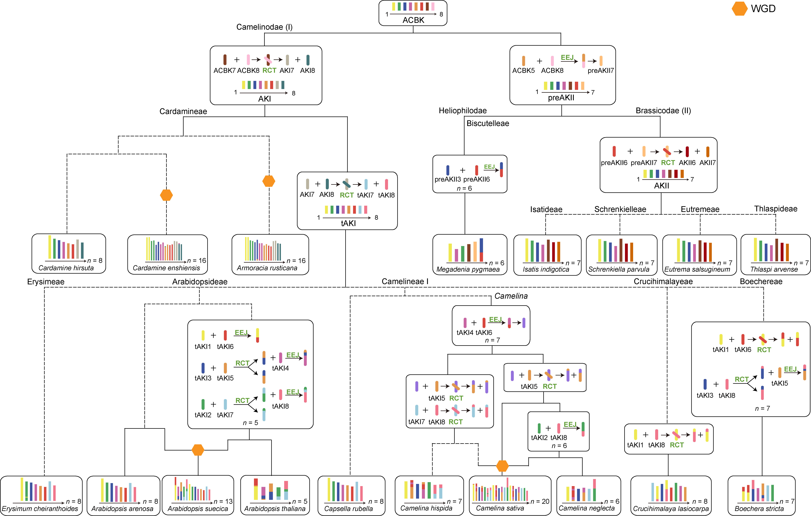

## The ancestral karyotype of supertribes Camelinodae and Brassicodae (ACBK)

We applied the workflow at https://github.com/SunPengChuan/wgdi-example/blob/main/Karyotype_Evolution.md to identify protochromosomes and to reconstruct the ancestral chromosome karyotype. 

Tracing the dynamic evolution of ancestral chromosomes, we reconstructed ancestral karyotypes for different nodes on the evolutionary tree. These ancestral karyotypes are contained in the 'ancestor' folder.

The relationships among these ancestral karyotypes are illustrated in the figure below.

